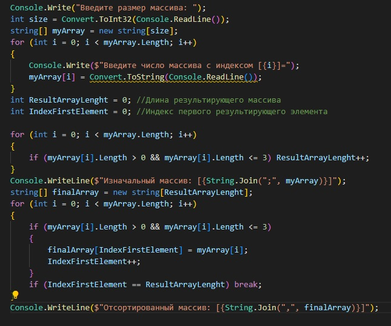

# Уважаемый,преподаватель!
Благодарю Вас за то,что нашли время на проверку моего задания.

Сейчас хотелось бы рассказать **каким образом происходило выполение данной работы**.

1. Изначально мною *была создана папка на локальном диске "С" под названием *"CHECK"* , которая была открыта в VSC и внутри неё я создала папку *"CheckPoint1"* → *"Excercize1"*;

2. После чего, открыв во встроенном терминале *"CheckPoint1"* я ввела команду *"git init"*,что позволило инициализировать локальный репозиторий и соответственно сохранять все изменения, происходящие в процессе работы;

3. Так же во встроенном терминале мною была открыта папка *"Excercize1"*, в которой я ввела команду *"dotnet new console"*, что позволило добавить файл *"Program.cs"*,в котором и началась основная работа;

4. В файле *"Program.cs"* :
+ сперва я ввела условие задачи, затем приступила к написанию кода;
+ задала условия на ввод данных с клавиатуры,что позволило сделать более универсальное применение;
+ ввела длину результирующего массива (*"ResulyArrayLenght"*), а также индекс первого результирующего элемента (*"IndexFirstElement*);
+ задала новый массив(для начала пустой);
+ создала условие, с помощью которого преступила к сортировке изначального массива, введеного с клавиатуры;
+ прописала условие выхода из цикла;
+ и в завершении вывела на консоль - "Отсортированный массив".

Код в VSC получился следующий:

Также эта информация представлена на блок-схеме:

а также она представлена в папке *"BlockSchema"* в формате *png* 

В завершении, хотелось бы сказать спасибо за интересное задание,которое заставило "поработать мозгами" :). Хочется верить в то,что и качество выполнения будет хорошее))))

## Благодарю За Внимание!

P.S.Прошу прощение за опоздание сдачи работы (стыдно)
![Stydno](

